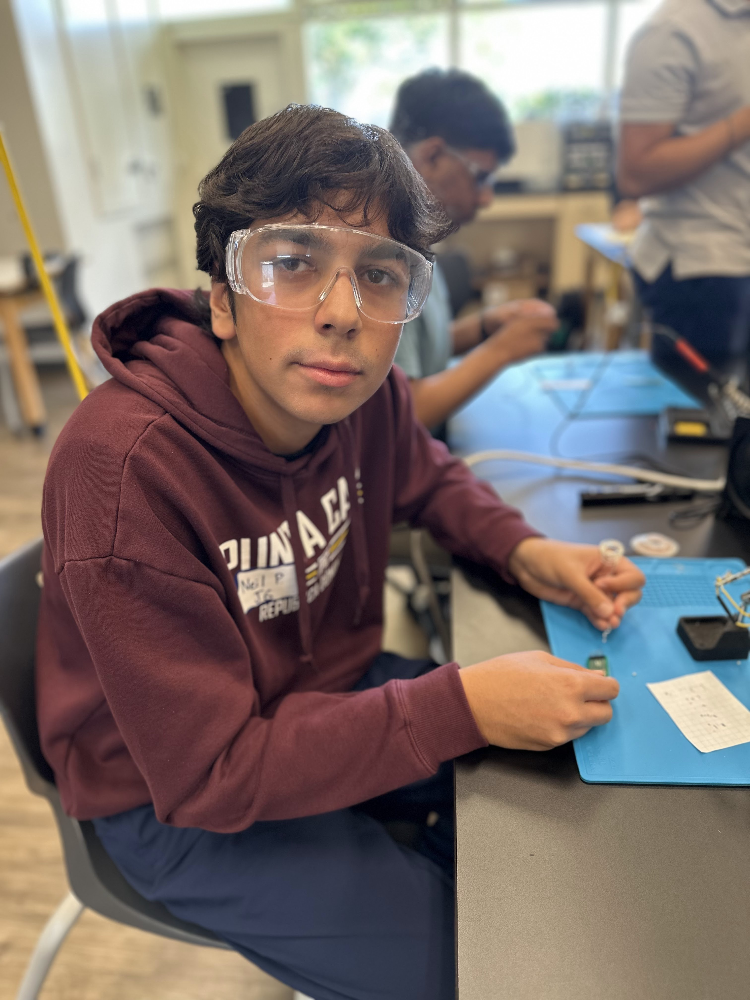
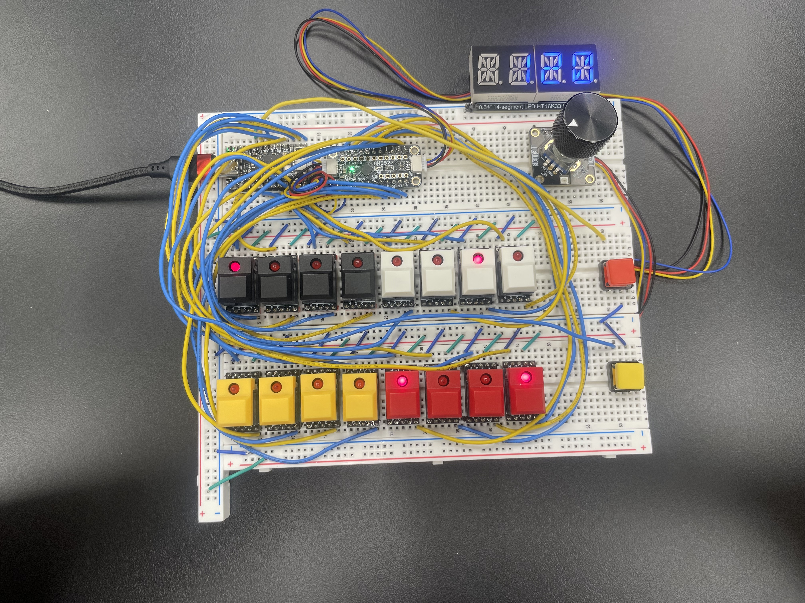
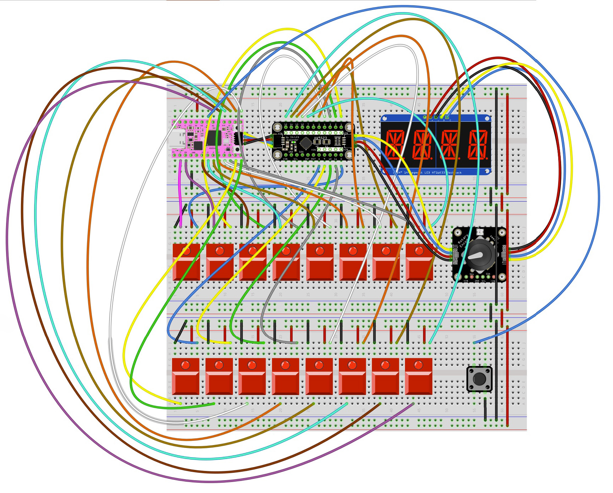

# Drum Sequencer
I am creating a drum sequencer which can loop and overlay mutiple drum sounds. This project uses garageband for its extensive library of these sound files. The sequencer itself consistes of 16 switches which each control a sixteenth note. There is a start and stop switch and a display that shows the BPM and current instrument you are using.


<!--- 


# Other Resources/Examples
One of the best parts about Github is that you can view how other people set up their own work. Here are some past BSE portfolios that are awesome examples. You can view how they set up their portfolio, and you can view their index.md files to understand how they implemented different portfolio components.
- [Example 1](https://trashytuber.github.io/YimingJiaBlueStamp/)
- [Example 2](https://sviatil0.github.io/Sviatoslav_BSE/)
- [Example 3](https://arneshkumar.github.io/arneshbluestamp/)

To watch the BSE tutorial on how to create a portfolio, click here.
-->


| **Engineer** | **School** | **Area of Interest** | **Grade** |
|:--:|:--:|:--:|:--:|
| Neil P | Saint Francis High School | Electrical Engineering | Incoming Junior


<!--  -->


# Modifications

## Saving through Serial Connection

For one of my modifications, I wanted to find a way to save presets of the beats made by the user, and I wanted the storage to be passive so it can persist without power. First, I thought to do this onto the KB2040 itself. I was going to create a local text file and edit it through Python. It turns out that CircuitPython makes it so you cannot edit any files other than code.py and the library folder. There is a workaround I found which makes the code.py able to edit and make files, but the user themselves can't access the storage of the KB2040. That was a dead end because I need to be able to edit the code.py myself. 

Next, I thought of a serial connection between the computer and KB2040. This would mean sending the presets to the computer for it to save them and being able to retrieve that info from the computer when needed.

# Final Milestone


<iframe width="560" height="315" src="https://www.youtube.com/embed/uWQ6JhBLypA?si=uTIynOiIZFmFwxqj" title="YouTube video player" frameborder="0" allow="accelerometer; autoplay; clipboard-write; encrypted-media; gyroscope; picture-in-picture; web-share" referrerpolicy="strict-origin-when-cross-origin" allowfullscreen></iframe>

## Summary

This milestone represents the completion of the project where all components were successfully integrated. I managed to add and correctly configure the display and encoder (how did i do this?). The display functioned well (what does well mean?), although the encoder initially faced several issues (see below). These included a loose jumper cable and an overly secured cover that impeded proper clicking. Throughout the project, I gained experience in soldering, wiring, coding, particularly in MIDI and serial connections, which I found especially valuable. This experience has fueled my interest in further exploring mechanical and electrical engineering.

## Challenges

One of the major challenges faced was the initial malfunctioning of the encoder due to hardware issues like loose jumper cables and an obstructive cover. Additionally, I encountered hazards like near burns from the soldering iron, the complexity of wiring to various ports, and the risk of damaging my projects. One significant hurdle was having to resolder numerous joints, which proved to be very time-consuming. These challenges provided a steep learning curve and highlighted areas for improvement in my technical processes and safety practices.

## Photos



# Second Milestone


<iframe width="560" height="315" src="https://www.youtube.com/embed/dBH9e26Z2OY?si=Q033aMItKdWRe3Hb" title="YouTube video player" frameborder="0" allow="accelerometer; autoplay; clipboard-write; encrypted-media; gyroscope; picture-in-picture; web-share" referrerpolicy="strict-origin-when-cross-origin" allowfullscreen></iframe>

## Summary

This milestone was pivotal in testing and validating my wiring and soldering skills. By using a straightforward piece of code, I was able to verify the functionality of sending and receiving signals to switches. Remarkably, everything operated correctly by the second attempt, which was unexpected as I had anticipated more issues due to potential errors and loose connections. Initially, I encountered challenges with some wires that were not securely connected, but these were resolved successfully. The next step is to focus on completing the display and encoder. My coding objective was to configure each LED to a low setting and test their ability to change in brightness.

## Challenges

One significant challenge faced during this milestone was ensuring all wires were securely connected, as some were loose during the initial testing phase. This required careful attention and adjustment to avoid signal transmission errors. The anticipation of potential errors heightened my focus on each connection, ensuring stability and reliability. Despite these hurdles, resolving the loose connections was a learning experience, contributing to my overall understanding and skills in wiring and soldering techniques. The next challenge lies ahead in perfecting the display and encoder, which will test my ability to integrate and program complex components effectively.


# First Milestone

<iframe width="560" height="315" src="https://www.youtube.com/embed/JQvFbUo3X28?si=sCmlM85Y7WuRculP" title="YouTube video player" frameborder="0" allow="accelerometer; autoplay; clipboard-write; encrypted-media; gyroscope; picture-in-picture; web-share" referrerpolicy="strict-origin-when-cross-origin" allowfullscreen></iframe>

## Summary

In the latest milestone, significant progress was made in assembling the electronic components. The AW9523 LED controller and the KB2040 keyboard driver were equipped with header pins, followed by soldering PCB chips onto switches and then attaching them to header pins. These components were interconnected on the board. Jumper cables were used to link the AW9523 and KB2040, which was then connected to the display and subsequently to the rotary encoder. Furthermore, wires were employed to connect LEDs to the AW9523 and additional wires to the KB2040.

## Challenges

Throughout the assembly process, measuring and stripping wires posed a significant challenge. The precision required in measuring was difficult to achieve, leading to numerous miscalculations and wasted materials. This highlighted the need for a more reliable wiring solution to enhance stability in future projects. The next step involves coding to verify the accuracy of the soldered switches and wiring, ensuring the assembly functions as intended.

# Schematics 



taken from [Amazon link](https://learn.adafruit.com/16-step-drum-sequencer/build-the-16-step-drum-sequencer)

# Code

```c++
# SPDX-FileCopyrightText: 2022 John Park for Adafruit Industries
#
# SPDX-License-Identifier: MIT
# Drum Trigger Sequencer 2040
# Based on code by Tod Kurt @todbot https://github.com/todbot/picostepseq

# Uses General MIDI drum notes on channel 10
# Range is note 35/B0 - 81/A4, but classic 808 set is defined here

import time
from adafruit_ticks import ticks_ms, ticks_diff, ticks_add
import board
from digitalio import DigitalInOut, Pull
import keypad
import adafruit_aw9523
import usb_midi
from adafruit_seesaw import seesaw, rotaryio, digitalio
from adafruit_debouncer import Debouncer
from adafruit_ht16k33 import segments


# define I2C
i2c = board.STEMMA_I2C()

num_steps = 16  # number of steps/switches
num_drums = 11  # primary 808 drums used here, but you can use however many you like
# Beat timing assumes 4/4 time signature, e.g. 4 beats per measure, 1/4 note gets the beat
bpm = 120  # default BPM
beat_time = 60/bpm  # time length of a single beat
beat_millis = beat_time * 1000  # time length of single beat in milliseconds
steps_per_beat = 4  # subdivide beats down to to 16th notes
steps_millis = beat_millis / steps_per_beat  # time length of a beat subdivision, e.g. 1/16th note

step_counter = 0  # goes from 0 to length of sequence - 1
sequence_length = 16  # how many notes stored in a sequence
curr_drum = 0
playing = False

# Setup button
start_button_in = DigitalInOut(board.A2)
start_button_in.pull = Pull.UP
start_button = Debouncer(start_button_in)


# Setup switches
switch_pins = (
                board.TX, board.RX, board.D2, board.D3,
                board.D4, board.D5, board.D6, board.D7,
                board.D8, board.D9, board.D10, board.MOSI,
                board.MISO, board.SCK, board.A0, board.A1
)
switches = keypad.Keys(switch_pins, value_when_pressed=False, pull=True)

# Setup LEDs
leds = adafruit_aw9523.AW9523(i2c, address=0x5B)  # both jumperes soldered on board
for led in range(num_steps):  # turn them off
    leds.set_constant_current(led, 0)
leds.LED_modes = 0xFFFF  # constant current mode
leds.directions = 0xFFFF  # output

# Values for LED brightness 0-255
offled = 0
dimled = 2
midled = 20
highled = 150

for led in range(num_steps):  # dramatic boot up light sequence
    leds.set_constant_current(led, dimled)
    time.sleep(0.05)
time.sleep(0.5)
#
# STEMMA QT Rotary encoder setup
rotary_seesaw = seesaw.Seesaw(i2c, addr=0x36)  # default address is 0x36
encoder = rotaryio.IncrementalEncoder(rotary_seesaw)
last_encoder_pos = 0
rotary_seesaw.pin_mode(24, rotary_seesaw.INPUT_PULLUP)  # setup the button pin
knobbutton_in = digitalio.DigitalIO(rotary_seesaw, 24)  # use seesaw digitalio
knobbutton = Debouncer(knobbutton_in)  # create debouncer object for button
encoder_pos = -encoder.position

# MIDI setup
midi = usb_midi.ports[1]

drum_names = [
                "Bass", "Snar", "LTom", "MTom", "HTom",
                "Clav", "Clap", "Cowb", "Cymb", "OHat", "CHat"
]
drum_notes = [36, 38, 41, 43, 45, 37, 39, 56, 49, 46, 42]  # general midi drum notes matched to 808

# default starting sequence needs to match number of drums in num_drums
sequence = [
    [ 1, 0, 0, 0,  0, 0, 0, 0,  1, 0, 1, 0,  0, 0, 0, 0 ], # bass drum
    [ 0, 0, 0, 0,  1, 0, 0, 0,  0, 0, 0, 0,  1, 0, 0, 0 ], # snare
    [ 1, 0, 0, 0,  0, 0, 0, 0,  0, 0, 0, 0,  1, 0, 0, 0 ], # low tom
    [ 0, 0, 0, 0,  0, 0, 0, 0,  0, 0, 0, 0,  0, 0, 1, 0 ], # mid tom
    [ 0, 0, 0, 0,  0, 0, 0, 0,  0, 0, 0, 0,  0, 0, 0, 1 ], # high tom
    [ 0, 1, 1, 1,  0, 0, 0, 0,  0, 0, 0, 0,  0, 0, 0, 0 ], # rimshot/claves
    [ 0, 0, 0, 1,  0, 0, 0, 0,  0, 0, 0, 0,  1, 1, 1, 0 ], # handclap/maracas
    [ 0, 0, 0, 0,  0, 1, 0, 1,  1, 0, 1, 0,  0, 0, 0, 0 ], # cowbell
    [ 1, 0, 0, 0,  0, 0, 0, 0,  0, 0, 0, 0,  0, 0, 0, 0 ], # cymbal
    [ 0, 0, 0, 0,  0, 0, 0, 0,  0, 0, 0, 0,  0, 1, 0, 0 ], # hihat open
    [ 0, 0, 0, 0,  0, 1, 1, 1,  0, 1, 1, 1,  0, 0, 1, 0 ]  # hihat closed
]

def play_drum(note):
    midi_msg_on = bytearray([0x99, note, 120])  # 0x90 is noteon ch 1, 0x99 is noteon ch 10
    midi_msg_off = bytearray([0x89, note, 0])
    midi.write(midi_msg_on)
    midi.write(midi_msg_off)

def light_steps(step, state):
    if state:
        leds.set_constant_current(step, midled)
    else:
        leds.set_constant_current(step, offled)

def light_beat(step):
    leds.set_constant_current(step, highled)

def edit_mode_toggle():
    # pylint: disable=global-statement
    global edit_mode
    # pylint: disable=used-before-assignment
    edit_mode = (edit_mode + 1) % num_modes
    display.fill(0)
    if edit_mode == 0:
        display.print(bpm)
    elif edit_mode == 1:
        display.print(drum_names[curr_drum])

def print_sequence():
    print("sequence = [ ")
    for k in range(num_drums):
        print(" [" + ",".join('1' if e else '0' for e in sequence[k]) + "], #", drum_names[k])
    print("]")

# set the leds
for j in range(sequence_length):
    light_steps(j, sequence[curr_drum][j])

display = segments.Seg14x4(i2c, address=(0x70))
display.brightness = 0.3
display.fill(0)
display.show()
display.print(bpm)
display.show()

edit_mode = 0  # 0=bpm, 1=voices
num_modes = 2

print("Drum Trigger 2040")


display.fill(0)
display.show()
display.marquee("Drum", 0.05, loop=False)
time.sleep(0.5)
display.marquee("Trigger", 0.075, loop=False)
time.sleep(0.5)
display.marquee("2040", 0.05, loop=False)
time.sleep(1)
display.marquee("BPM", 0.05, loop=False)
time.sleep(0.75)
display.marquee(str(bpm), 0.1, loop=False)


while True:
    start_button.update()
    if start_button.fell:  # pushed encoder button plays/stops transport
        if playing is True:
            print_sequence()
        playing = not playing
        step_counter = 0
        last_step = int(ticks_add(ticks_ms(), -steps_millis))
        print("*** Play:", playing)

    if playing:
        now = ticks_ms()
        diff = ticks_diff(now, last_step)
        if diff >= steps_millis:
            late_time = ticks_diff(int(diff), int(steps_millis))
            last_step = ticks_add(now, - late_time//2)

            light_beat(step_counter)  # brighten current step
            for i in range(num_drums):
                if sequence[i][step_counter]:  # if there's a 1 at the step for the seq, play it
                    play_drum(drum_notes[i])
            light_steps(step_counter, sequence[curr_drum][step_counter])  # return led to step value
            step_counter = (step_counter + 1) % sequence_length
            encoder_pos = -encoder.position  # only check encoder while playing between steps
            knobbutton.update()
            if knobbutton.fell:
                edit_mode_toggle()
    else:  # check the encoder all the time when not playing
        encoder_pos = -encoder.position
        knobbutton.update()
        if knobbutton.fell:  # change edit mode, refresh display
            edit_mode_toggle()

    # switches add or remove steps
    switch = switches.events.get()
    if switch:
        if switch.pressed:
            i = switch.key_number
            sequence[curr_drum][i] = not sequence[curr_drum][i]  # toggle step
            light_steps(i, sequence[curr_drum][i])  # toggle light

    if encoder_pos != last_encoder_pos:
        encoder_delta = encoder_pos - last_encoder_pos
        if edit_mode == 0:
            bpm = bpm + encoder_delta  # or (encoder_delta * 5)
            bpm = min(max(bpm, 10), 400)
            beat_time = 60/bpm  # time length of a single beat
            beat_millis = beat_time * 1000
            steps_millis = beat_millis / steps_per_beat
            display.fill(0)
            display.print(bpm)
        if edit_mode == 1:
            curr_drum = (curr_drum + encoder_delta) % num_drums
            # quickly set the step leds
            for i in range(sequence_length):
                light_steps(i, sequence[curr_drum][i])
            display.print(drum_names[curr_drum])
        last_encoder_pos = encoder_pos

````


# Bill of Materials


| **Part** | **Note** | **Price** | **Link** |
|:--:|:--:|:--:|:--:|
| Adafruit KB2040 - RP2040 Kee BoarD | Used to control switch inputs and overall system logic | $8.95 | <a href="https://www.adafruit.com/product/5302"> Link </a> |
| Adafruit AW9523 GPIO Expander and LED Driver Breakout | Controls all the LEDs inside the step switches | $4.95 | <a href="https://www.adafruit.com/product/4886"> Link </a> |
| Adafruit 14-segment LED Alphanumeric Backpack - STEMMA QT | The controller 14 segment display | $6.00 | <a href="https://www.adafruit.com/product/1910"> Link </a> |
| Step Switch with LED - Three Pack of Red Plastic with Red LED | Used as a form of input for the machine | $4.50 | <a href="https://www.adafruit.com/product/5499"> Link </a> |
| Step Switch with LED - Three Pack of White Plastic with Red LED - PB86 | Used as a form of input for the machine | $4.50 | <a href="https://www.adafruit.com/product/5519"> Link </a> |
| Step Switch with LED - Three Pack of Yellow Plastic with Red LED | Used as a form of input for the machine | $4.50 | <a href="https://www.adafruit.com/product/5516"> Link </a> |
| Step Switch with LED - Three Pack of Black Plastic with Red LED - PB86 | Used as a form of input for the machine | $4.50 | <a href="https://www.adafruit.com/product/5502"> Link </a> |
| PB86 Step Switch Breadboard-Friendly Breakout PCB - Pack of 12 | Attachs to the back of step switch so it can attach to breadboard | $3.95 | <a href="https://www.adafruit.com/product/5631"> Link </a> |
| Break-away 0.1" 36-pin strip male header - Black - 10 pack | Header pins to solder onto almost everything | $4.95 | <a href="https://www.adafruit.com/product/392"> Link </a> |
| Colorful Square Buttons - 15 pack | Used for the menu and start/stop buttons | $5.95 | <a href="https://www.adafruit.com/product/1010"> Link </a> |
| Hook-up Wire Spool Set - 22AWG Solid Core - 6 x 25 ft | Used for wiring up the whole project | $15.95 | <a href="https://www.adafruit.com/product/1311"> Link </a> |


# Starter Milestone


<iframe width="560" height="315" src="https://www.youtube.com/embed/nsgoU_Tmdgo?si=OyY_uH3aMOAk1GA9" title="YouTube video player" frameborder="0" allow="accelerometer; autoplay; clipboard-write; encrypted-media; gyroscope; picture-in-picture; web-share" referrerpolicy="strict-origin-when-cross-origin" allowfullscreen></iframe>

I created a retro game arcade that consisted of many parts soldered together to create the final project. It is a cool idea that you can practice soldering in a usable application. The challenge that I faced was that I had to solder very small and fragile parts. I came very close to almost damaging other parts of the project with the hot iron. I feel that after this project, I am pretty comfortable with soldering. The project consisted of LED dot matrix displays and switches that controlled the different games. There was also a buzzer that provided those retro-themed soundtracks.


taken from [Amazon](https://www.amazon.com/Classic-Electronic-Soldering-Tetris-Machine/dp/B07HB3HPPJ/ref=asc_df_B07HB3HPPJ?mcid=b00b7893f57d3a19abc2f6c187ac48cd&hvocijid=13293929008172315056-B07HB3HPPJ-&hvexpln=73&tag=hyprod-20&linkCode=df0&hvadid=721245378154&hvpos=&hvnetw=g&hvrand=13293929008172315056&hvpone=&hvptwo=&hvqmt=&hvdev=c&hvdvcmdl=&hvlocint=&hvlocphy=9032183&hvtargid=pla-2281435179338&th=1
)

